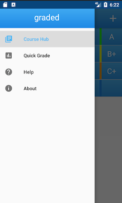
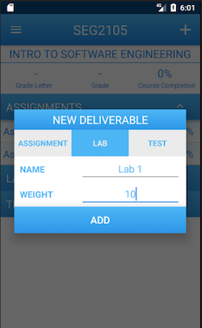

# graded-android
Android application to help students track their grades throughout courses. Developed by myself and Pasoon Azimi for our User Interface course.

Graded helps students whether they need to figure out what grade they need on a final exam or if they want to keep track of their current grade in a specific course, graded has them covered. 

Designed using Android Studio and using Realm for database management. 

You can view the application on Google play: https://play.google.com/store/apps/details?id=tempo.graded&hl=en

# Some Screenshots of the Application

